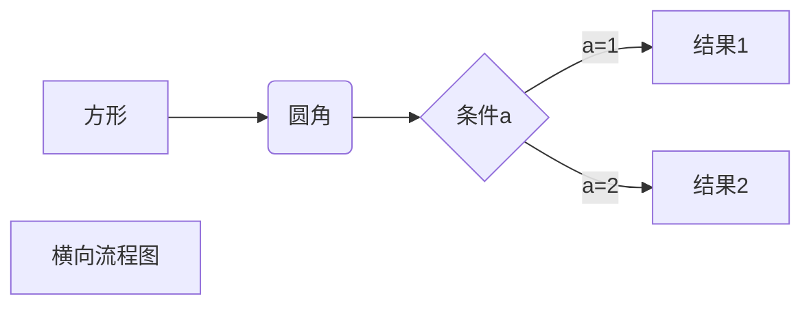

### 标注

双空格 换行  
_斜体文本_  
_斜体文本_  
**粗体文本**  
**粗体文本**  
**_粗斜体文本_**  
**_粗斜体文本_**  
~~BAIDU.COM~~  
<u>带下划线文本</u>  
[^要注明的文本]

### 列表

1. 第一项：
   - 第一项嵌套的第一个元素
   - 第一项嵌套的第二个元素
2. 第二项：
   - 第二项嵌套的第一个元素
   - 第二项嵌套的第二个元素
3. 第三项：
   - 第二项嵌套的第一个元素
   - 第二项嵌套的第二个元素

### 区块

> 区块引用
> 菜鸟教程
> 学的不仅是技术更是梦想

> 最外层
>
> > 第一层嵌套
> >
> > > 第二层嵌套

### 代码

```javascript
$(document).ready(function () {
  alert('RUNOOB');
});
```

### 链接

[菜鸟教程](https://www.runoob.com)
<https://www.runoob.com>

### 图片

  
使用 <kbd>Ctrl</kbd>+<kbd>Alt</kbd>+<kbd>Del</kbd> 重启电脑  
 使用反斜杠转义特殊字符  
**文本加粗**  
\*\* 正常显示星号 \*\*

### 表格

| 表头   | 表头   |
| ------ | ------ |
| 单元格 | 单元格 |
| 单元格 | 单元格 |

- 我们可以设置表格的对齐方式：  
  -: 设置内容和标题栏居右对齐。  
  :- 设置内容和标题栏居左对齐。  
  :-: 设置内容和标题栏居中对齐。

| 左对齐 | 右对齐 | 居中对齐 |
| :----- | -----: | :------: |
| 单元格 | 单元格 |  单元格  |
| 单元格 | 单元格 |  单元格  |

### 流程图



### vuepress内置语法
**容器**
::: tip
这是一个提示
:::

::: warning
这是一个警告
:::

::: danger
这是一个危险警告
:::

::: details
这是一个 details 标签，在 IE / Edge 中不生效
:::

### vuepress 内置组件

<Badge type="tip" text="标签" vertical="top" />

<CodeGroup>
  <CodeGroupItem title="YARN">

```bash:no-line-numbers
yarn
```

  </CodeGroupItem>

  <CodeGroupItem title="NPM" active>

```bash:no-line-numbers
npm install
```

  </CodeGroupItem>
</CodeGroup>

``` html
<head> 
    <script defer src="https://use.fontawesome.com/releases/v5.0.13/js/all.js"></script> 
    <script defer src="https://use.fontawesome.com/releases/v5.0.13/js/v4-shims.js"></script> 
</head> 
<link rel="stylesheet" href="https://use.fontawesome.com/releases/v5.0.13/css/all.css">
```
[图标搜索](https://fontawesome.com/v5.15/icons?d=gallery&p=2&m=free)
